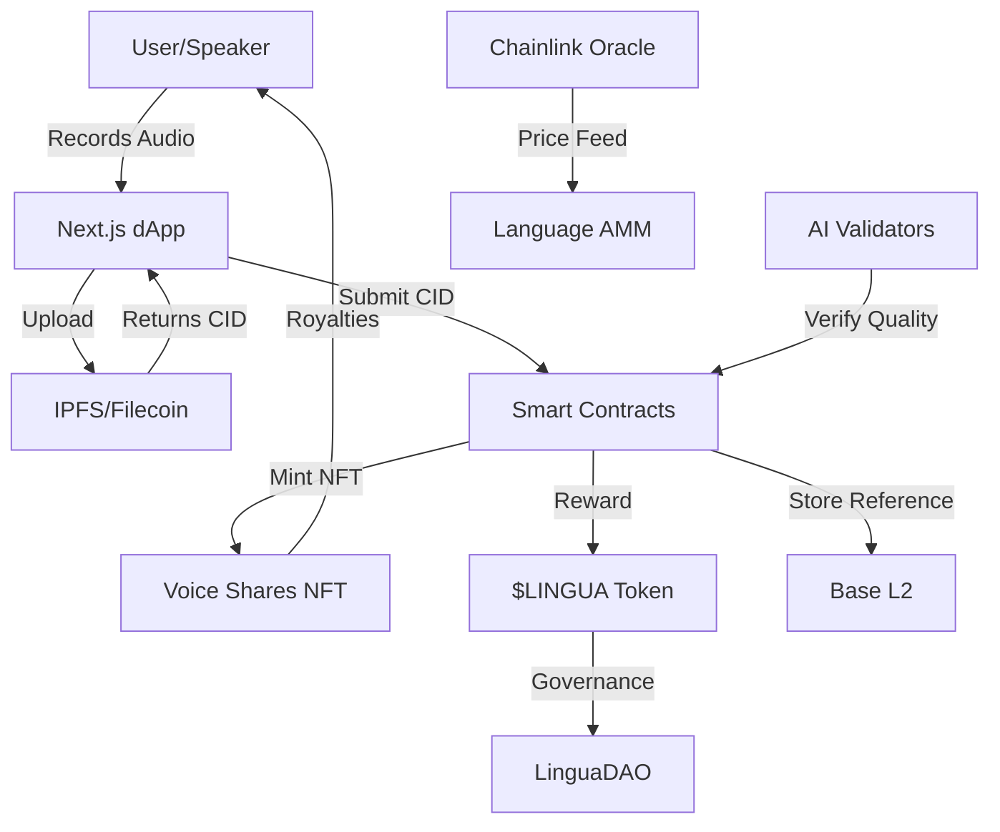

# LinguaDAO System Architecture

## 🌍 Overview
LinguaDAO is a decentralized language preservation protocol built on Base L2, combining DeFi mechanics with cultural preservation through our innovative "Proof of Voice" consensus mechanism.

## 🎯 Core Components

### 1. **Smart Contract Layer** (Base L2)
```
┌─────────────────────────────────────────────────────────┐
│                    Smart Contracts                       │
├─────────────────────────────────────────────────────────┤
│  LinguaToken.sol         │  ERC-20 Governance Token     │
│  VoiceSharesNFT.sol      │  ERC-721 Voice Ownership     │
│  LinguaDAO.sol           │  DAO Governance              │
│  LanguagePoolsAMM.sol    │  DEX for Language Tokens    │
│  ExtinctionInsurance.sol │  Insurance Pools             │
└─────────────────────────────────────────────────────────┘
```

### 2. **Data Layer** (Decentralized Storage)
```
┌─────────────────────────────────────────────────────────┐
│                  Decentralized Storage                   │
├─────────────────────────────────────────────────────────┤
│  IPFS/Filecoin          │  Audio Data Storage          │
│  Web3.Storage           │  Metadata & Indexing         │
│  Chainlink Oracles      │  Price Feeds & Verification  │
└─────────────────────────────────────────────────────────┘
```

### 3. **Application Layer** (dApp)
```
┌─────────────────────────────────────────────────────────┐
│                    Frontend (Next.js)                    │
├─────────────────────────────────────────────────────────┤
│  Voice Mining Interface  │  Record & Submit Audio       │
│  NFT Gallery            │  Browse Voice Collections     │
│  DEX Interface          │  Trade Language Tokens       │
│  DAO Dashboard          │  Governance & Voting         │
│  Analytics Dashboard    │  Language Health Metrics     │
└─────────────────────────────────────────────────────────┘
```

## 🔄 Data Flow Architecture



## 💰 Economic Architecture

### Token Flow
```
Voice Recording → Quality Score → Mining Rewards → $LINGUA Tokens
                                         ↓
                              Voice Share NFT (Ownership)
                                         ↓
                              Lifetime Royalties from AI Usage
```

### Reward Formula
```javascript
Reward = BaseRate × QualityScore × RarityMultiplier × StakingBoost

Where:
- BaseRate: 100 $LINGUA
- QualityScore: 0.0 - 1.0 (AI validated)
- RarityMultiplier: 1x - 5x (based on language endangerment)
- StakingBoost: 1x - 2x (based on $LINGUA staked)
```

## 🔐 Security Architecture

### Multi-Layer Security
1. **Smart Contract Security**
   - OpenZeppelin battle-tested contracts
   - Multi-sig treasury
   - Time-locked upgrades
   - Slither/Mythril audited

2. **Data Integrity**
   - IPFS content addressing
   - Chainlink oracle verification
   - Merkle tree proofs for batch submissions

3. **Access Control**
   - Role-based permissions
   - Gradual decentralization
   - Community-driven governance

## 🌐 Network Architecture

```
┌──────────────────────────────────────────────────────────┐
│                     Global Network                        │
├──────────────────────────────────────────────────────────┤
│                                                           │
│   Region: West Africa        Region: East Africa         │
│   ┌─────────────────┐       ┌─────────────────┐        │
│   │  Ghana Node     │       │  Kenya Node     │        │
│   │  Nigeria Node   │       │  Ethiopia Node  │        │
│   │  Senegal Node   │       │  Tanzania Node  │        │
│   └─────────────────┘       └─────────────────┘        │
│                                                           │
│              Connected via Base L2 (Ethereum)            │
└──────────────────────────────────────────────────────────┘
```

## 📊 AI Integration Architecture

### Voice Processing Pipeline
```
Audio Input → Noise Reduction → Feature Extraction → Quality Scoring
     ↓              ↓                  ↓                    ↓
  Storage      Validation        Language Model      Reward Calculation
```

### AI Model Training
```
Collected Voice Data → Training Dataset → Language Models
                              ↓
                    Commercial AI Products
                              ↓
                    Revenue Distribution to NFT Holders
```

## 🚀 Scaling Architecture

### Phase 1: Foundation (Current)
- 5 core languages
- 1,000 contributors
- Basic AMM functionality

### Phase 2: Growth (Q2 2025)
- 20 languages
- 10,000 contributors
- Advanced DeFi features
- Mobile app launch

### Phase 3: Scale (Q4 2025)
- 47+ languages
- 100,000+ contributors
- Cross-chain bridges
- AI marketplace launch

## 🔄 Governance Architecture

```
Token Holders → Proposals → Voting → Execution
                    ↓          ↓         ↓
              Discussion   Quorum   Timelock
                    ↓          ↓         ↓
              Community    51%     48 hours
```

## 🏗️ Technical Stack

### Smart Contracts
- **Language**: Solidity 0.8.20
- **Framework**: Hardhat + Foundry
- **Libraries**: OpenZeppelin 5.0
- **Network**: Base L2 (OP Stack)

### Frontend
- **Framework**: Next.js 14 (App Router)
- **Language**: TypeScript
- **Styling**: Tailwind CSS
- **Web3**: RainbowKit + Wagmi + Viem

### Storage
- **Audio**: IPFS + Filecoin
- **Metadata**: Web3.Storage
- **Indexing**: The Graph Protocol

### Infrastructure
- **RPC**: Alchemy/Infura
- **Oracles**: Chainlink
- **Analytics**: Dune Analytics
- **Monitoring**: Tenderly

## 📈 Performance Metrics

### Target Metrics
- **Transaction Speed**: <2 seconds
- **Gas Cost**: <$0.10 per submission
- **Audio Upload**: <5 seconds
- **UI Response**: <100ms
- **Uptime**: 99.9%

## 🔗 Integration Points

### External Services
1. **Chainlink**: Price feeds, VRF for randomness
2. **The Graph**: Query protocol data
3. **IPFS Gateways**: Distributed content delivery
4. **Base Sequencer**: Transaction processing
5. **Mobile Money APIs**: Fiat on/off ramps

## 🎯 Success Metrics

### Technical KPIs
- Smart contract TVL
- Daily active users
- Transaction volume
- NFTs minted
- Languages preserved

### Impact KPIs
- Speaker earnings
- Language vitality scores
- AI model accuracy
- Community growth
- Cultural impact score

---

## 🚀 Deployment Architecture

### Mainnet Contracts (Base)
- LinguaToken: `0x9aB86b04D321b5dB9a2E6F2CFbE2B028Cc6df21D`
- VoiceSharesNFT: `0xCC1D5C4e4b2B9aafADd31976051f52dF3d8f1308`
- LinguaDAO: `0xf94CC32C9cD25d565C54fE54DC5AeEe159FB910a`
- LanguagePoolsAMM: `0x9744Ed27A3353B3B73243A0A656188854188f2DD`
- ExtinctionInsurance: `0xa3dc5A67cB29cD07705Fe9282FAE870CA1017929`

### Infrastructure
- **IPFS Gateway**: https://w3s.link/ipfs/
- **RPC Endpoint**: https://sepolia.base.org
- **Block Explorer**: https://sepolia.basescan.org

---

*This architecture is designed for massive scale while maintaining decentralization and cultural sensitivity.*