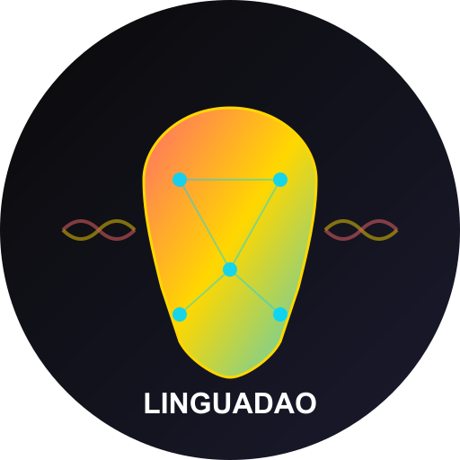

# LinguaDAO - The First Decentralized Language Preservation Protocol



## 🏆 ETHAccra 2025 Hackathon Submission

### 🎨 Track: Culture, Creativity & Community
> Preserving African languages through NFTs, DAOs, and community ownership - empowering creators and unlocking new models of collective cultural preservation.

> **For Judges**: Jump to [Quick Start for Hackathon Judges](#-quick-start-for-hackathon-judges) for installation instructions (5 minutes setup)

### 🎯 One-Line Pitch
The first protocol where preserving endangered languages pays better than abandoning them.

### 🔗 Live Deployment
- **🌐 Live LinguaDAO Platform**: [https://linguadao.vercel.app/](https://linguadao.vercel.app/) (Production deployment)
- **🎮 Demo App**: [https://linguanetai-pt2g5q21w-popos-projects-fb891440.vercel.app/](https://linguanetai-pt2g5q21w-popos-projects-fb891440.vercel.app/) (Test on Base Sepolia)
- **📊 Interactive Pitch Deck**: [https://linguadao.vercel.app/pitch](https://linguadao.vercel.app/pitch) (Swipe-enabled mobile presentation)
- **GitHub Repository**: [https://github.com/ma-za-kpe/linguanet](https://github.com/ma-za-kpe/linguanet)
- **Demo Video**: [LinguaDAO Walkthrough](https://linguadao.vercel.app/demo) (3-minute overview)
- **Demo Video**: [https://youtu.be/fWFL5xup3Bg]

### 📜 Deployed Smart Contracts (Base Sepolia)

| Contract | Address | View on BaseScan |
|----------|---------|------------------|
| **LinguaToken** | `0x9aB86b04D321b5dB9a2E6F2CFbE2B028Cc6df21D` | [View](https://sepolia.basescan.org/address/0x9aB86b04D321b5dB9a2E6F2CFbE2B028Cc6df21D) |
| **VoiceSharesNFT** | `0xCC1D5C4e4b2B9aafADd31976051f52dF3d8f1308` | [View](https://sepolia.basescan.org/address/0xCC1D5C4e4b2B9aafADd31976051f52dF3d8f1308) |
| **LinguaDAO** | `0xf94CC32C9cD25d565C54fE54DC5AeEe159FB910a` | [View](https://sepolia.basescan.org/address/0xf94CC32C9cD25d565C54fE54DC5AeEe159FB910a) |
| **LanguagePoolsAMM** | `0x9744Ed27A3353B3B73243A0A656188854188f2DD` | [View](https://sepolia.basescan.org/address/0x9744Ed27A3353B3B73243A0A656188854188f2DD) |
| **ExtinctionInsurance** | `0xa3dc5A67cB29cD07705Fe9282FAE870CA1017929` | [View](https://sepolia.basescan.org/address/0xa3dc5A67cB29cD07705Fe9282FAE870CA1017929) |

## 🌍 Saving 3,000+ Endangered African Languages Through Blockchain

Every 40 days, a language dies forever. LinguaDAO is the first protocol where preserving culture pays better than abandoning it.

### 🎯 Mission
Transform language preservation from a charity into a profitable ecosystem through Web3 incentives and community ownership.

## ✨ Core Features

### 🎙️ Proof of Voice Mining
- **Record** 30-second audio samples in your native language
- **Earn** 100-400 $LINGUA tokens per recording
- **Mine** rewards based on quality, rarity, and staking multipliers

### 🎨 Voice Share NFTs
- Own fractional shares of AI models trained on your data
- Receive lifetime royalties from model usage
- Trade on secondary markets

### 💱 Language AMM (Automated Market Maker)
- First-ever DEX for language data tokens
- Trade pairs: TWI/USDC, YOR/USDC, SWA/USDC
- Provide liquidity and earn fees

### 🛡️ Extinction Insurance
- Revolutionary DeFi primitive for cultural preservation
- 10x payout if a language becomes extinct
- Community-funded insurance pools

### 🗳️ DAO Governance
- 1 $LINGUA = 1 Vote
- Communities control their linguistic data
- Decide on preservation priorities and fund allocation

## 🚀 Quick Start for Hackathon Judges

### Prerequisites
- Node.js 18+ and npm/yarn
- MetaMask or any Web3 wallet
- Git

### 🎯 Installation Instructions (5 minutes)

```bash
# 1. Clone the repository
git clone https://github.com/linguadao/linguanet.git
cd linguanet

# 2. Install dependencies
npm install
# or if you prefer yarn
yarn install

# 3. Set up environment variables
cp .env.local.example .env.local

# 4. Run the development server
npm run dev
# or
yarn dev
```

### 🌐 Access the Application
Open [http://localhost:3000](http://localhost:3000) or [http://localhost:3001](http://localhost:3001) in your browser.

### 🔧 Configuration for Testing

The `.env.local.example` file contains all necessary configurations:

1. **Smart contracts**: All contracts are live on Base Sepolia
2. **IPFS storage**: Fully functional with Web3.Storage
3. **Wallet connection**: Connect with MetaMask or any Web3 wallet
4. **Test tokens**: Get Base Sepolia ETH from the faucet

### 📱 Key Features to Test

1. **Voice Mining** (`/contribute`)
   - Record 30-second audio samples
   - See reward calculations in real-time
   - Mint Voice Share NFTs on Base Sepolia

2. **NFT Gallery** (`/gallery`)
   - Browse Voice Share NFTs with audio playback
   - View real-time rewards and ownership percentages
   - Filter by language and owner
   - Mobile-responsive gallery interface
   - Filter by language and ownership

3. **Interactive Pitch** (`/pitch`)
   - Navigate with arrow keys or click
   - Full pitch deck explaining the protocol

4. **Dashboard** (`/dashboard`)
   - AI company view for purchasing datasets
   - Analytics and metrics visualization

### 🧪 Testing with Wallet (Optional)

If you want to test with a real wallet:

1. **Get Base Sepolia ETH**:
   - Visit [Base Sepolia Faucet](https://www.alchemy.com/faucets/base-sepolia)
   - Enter your wallet address
   - Receive free test ETH

2. **Connect Wallet**:
   - Click "Connect Wallet" in the app
   - Select MetaMask or your preferred wallet
   - Switch to Base Sepolia network (the app will prompt you)

3. **Test Transactions**:
   - Record audio and mint Voice Share NFTs
   - Stake $LINGUA tokens
   - Participate in governance

### 🐛 Troubleshooting

| Issue | Solution |
|-------|----------|
| Port 3000 in use | The app will auto-switch to port 3001 |
| Module not found | Run `npm install` again |
| Wallet connection fails | Ensure you're on Base Sepolia network |
| Audio recording doesn't work | Allow microphone permissions in browser |

### 📝 Live Features

- **Voice Mining**: Record real audio and mint NFTs
- **NFT Gallery**: Interactive Voice Share NFT gallery with audio playback and mobile optimization
- **Rewards**: Live $LINGUA token calculations
- **IPFS Storage**: All recordings stored on decentralized network

### 🎥 Video Demo

Watch our 3-minute walkthrough: [Coming soon]

### Smart Contract Deployment

```bash
# Compile contracts
npx hardhat compile

# Deploy to Base Sepolia
npx hardhat run scripts/deploy.js --network base-sepolia

# Verify contracts
npx hardhat verify --network base-sepolia <CONTRACT_ADDRESS>
```

## 🏗️ Architecture

### Smart Contracts (Base L2)
- **LinguaToken.sol** - ERC20 governance token with mining rewards
- **VoiceSharesNFT.sol** - ERC721 for fractional AI model ownership  
- **LanguagePoolsAMM.sol** - Uniswap V2 fork for language tokens
- **ExtinctionInsurance.sol** - DeFi insurance primitive
- **LinguaDAO.sol** - OpenZeppelin Governor for on-chain governance

### Technology Stack
- **Frontend**: Next.js 14, TypeScript, TailwindCSS
- **Blockchain**: Base L2, Hardhat, ethers.js
- **Storage**: IPFS (Web3.Storage) for audio files
- **Identity**: ENS subdomains for user profiles
- **Wallet**: RainbowKit for multi-wallet support

## 📊 Token Economics

### $LINGUA Token
- **Total Supply**: 1 billion tokens
- **Distribution**:
  - 40% - Mining Rewards (vested over 10 years)
  - 20% - Community Treasury (DAO-controlled)
  - 15% - Initial Liquidity
  - 15% - Team & Advisors (2-year vesting)
  - 10% - Ecosystem Grants

### Reward Formula
```
Reward = Base Rate × Quality Score × Language Rarity × Staking Multiplier
```

## 🤝 Contributing

We welcome contributions to save endangered languages! Please see [CONTRIBUTING.md](CONTRIBUTING.md) for guidelines.

### Development Workflow
1. Fork the repository
2. Create a feature branch (`git checkout -b feature/amazing-feature`)
3. Commit changes (`git commit -m 'Add amazing feature'`)
4. Push to branch (`git push origin feature/amazing-feature`)
5. Open a Pull Request

## 📈 Roadmap

### Phase 1: Foundation (Q1 2025)
- ✅ Core smart contracts deployment
- ✅ Voice mining interface
- ✅ Basic DAO governance
- 🔄 Integration with mobile money (MTN, M-Pesa)

### Phase 2: Expansion (Q2 2025)
- Language AMM launch
- Extinction insurance pools
- AI model marketplace
- Mobile app release

### Phase 3: Scale (Q3-Q4 2025)
- 47+ African languages supported
- Cross-chain bridges
- Partnership with UNESCO
- $15M TVL target

## 🌟 Impact Metrics

- **Languages Targeted**: 47 critically endangered
- **Communities Served**: 100,000+ speakers
- **Economic Value Created**: $3M+ annually
- **Data Preserved**: 10,000+ hours of audio

## 📜 License

This project is licensed under the MIT License - see [LICENSE](LICENSE) file for details.

## 🔗 Links

- **Website**: [https://linguadao.africa](https://linguadao.africa)
- **Documentation**: [https://docs.linguadao.africa](https://docs.linguadao.africa)
- **Twitter**: [@LinguaDAO](https://twitter.com/LinguaDAO)
- **Discord**: [Join our community](https://discord.gg/linguadao)
- **Email**: team@linguadao.africa

## 🙏 Acknowledgments

- ETHAccra 2025 Hackathon
- Buidl Guidl Grant Program
- Base L2 Team
- Web3.Storage
- All contributors preserving African languages

---

**"The future of Africa speaks every language"** 🌍

Built with ❤️ for language preservation
=======
# 🌍 LinguaNet - Turn Your Voice into Value

[](https://ethaccra.xyz)
[](https://nextjs.org)
[](https://typescriptlang.org)
[](LICENSE)

> **Decentralized African Language Data Marketplace** - Preserving Languages, Powering AI, Creating Economic Opportunity

LinguaNet enables African language speakers to monetize their linguistic knowledge while providing AI companies with authentic, verified language datasets. Built on blockchain infrastructure with mobile-first UX.

## 🚀 Live Demo

- **Production**: [https://linguanet.vercel.app](https://linguanet.vercel.app)
- **Development**: Auto-deployed from `develop` branch
- **Pitch Deck**: [https://linguanet.vercel.app/pitch](https://linguanet.vercel.app/pitch)

## ✨ Key Features

### For Contributors
- 📱 **No crypto knowledge needed** - Login with phone number
- 🎤 **30-second recordings** - Earn $3 USDC per verified clip
- 💰 **Instant mobile money withdrawal** - MTN, M-Pesa, AirtelTigo
- 🌍 **ENS identity** - Get your own .linguanet.eth name

### For Validators
- ✅ **Quality verification** - $0.50 per validation
- 🏅 **EFP reputation system** - Build on-chain trust
- 🔥 **Streak rewards** - Bonus payments for consistency

### For AI Companies
- 📊 **Verified datasets** - Native speaker quality guaranteed
- 🚀 **API access** - Real-time data streaming
- 💾 **Filecoin storage** - Decentralized, permanent hosting
- 🎯 **12 African languages** - Twi, Swahili, Yoruba, and more

## 🛠️ Quick Start for Developers

### Prerequisites
- Node.js 18+
- npm/yarn/pnpm
- Git

### Setup

```bash
# Clone the repository
git clone https://github.com/ma-za-kpe/linguanet.git
cd linguanet

# Install dependencies
npm install

# Start development server
npm run dev
```

Open [http://localhost:3000](http://localhost:3000) to see the app.

### Available Scripts

```bash
# Development
npm run dev          # Start development server (port 3000)
npm run build        # Production build
npm run start        # Start production server

# Code Quality
npm run lint         # Run ESLint
npm run lint:fix     # Fix ESLint issues automatically

# Type checking
npm run type-check   # Run TypeScript compiler check
```

## 📁 Project Structure

```
linguanet/
├── app/                    # Next.js App Router
│   ├── contribute/         # Contributor interface ($3/recording)
│   ├── dashboard/          # AI company dataset browser
│   ├── pitch/             # Investor pitch deck
│   └── page.tsx           # Landing page
├── contracts/             # Smart contracts (Base L2)
├── public/               # Static assets, favicon, manifest
├── .github/workflows/    # CI/CD pipelines
└── scripts/              # Utility scripts
```

## 🌐 Tech Stack

### Frontend
- **Next.js 15.5.2** with App Router and Turbopack
- **TypeScript** for type safety
- **Framer Motion** for animations
- **Tailwind CSS** (via custom CSS)
- **React Icons** (Feather Icons)

### Blockchain
- **Base L2** for cheap, fast transactions
- **ENS** for human-readable identities
- **USDC** for stable payments
- **EFP** for reputation and attestations

### Storage & AI
- **Filecoin** for decentralized storage
- **TensorFlow.js** for client-side AI quality checks
- **Custom API** for dataset access

### Deployment
- **Vercel** for hosting and CI/CD
- **GitHub Actions** for automated testing
- **Mobile Money APIs** for cashout

## 🔄 Git Workflow

We use a **develop-first** workflow for team collaboration:

### Branch Strategy
```
main (production) ← develop ← feature/your-feature
```

### For New Contributors

1. **Fork and clone**
   ```bash
   git clone https://github.com/YOUR_USERNAME/linguanet.git
   cd linguanet
   ```

2. **Work on develop branch**
   ```bash
   git checkout develop
   git pull origin develop
   ```

3. **Create feature branch**
   ```bash
   git checkout -b feature/awesome-feature
   # Make your changes
   git add .
   git commit -m "✨ Add awesome feature"
   git push -u origin feature/awesome-feature
   ```

4. **Create Pull Request**
   - Target: `feature/awesome-feature` → `develop`
   - Use PR template for description
   - Wait for code review and CI checks

5. **Production deployment** (maintainers only)
   ```bash
   git checkout main
   git merge develop
   git push origin main
   # Auto-deploys to production
   ```

### Commit Message Format
```
✨ feat: add new feature
🐛 fix: bug fix
📚 docs: documentation
🎨 style: formatting
♻️  refactor: code restructure
🧪 test: adding tests
🚀 deploy: deployment related
```

## 🧪 Testing Your Changes

Before submitting a PR, ensure:

```bash
# 1. Code passes linting
npm run lint

# 2. Build succeeds
npm run build

# 3. All pages load correctly
npm run dev
# Visit http://localhost:3000, /contribute, /dashboard, /pitch

# 4. Mobile responsiveness works
# Test on different screen sizes
```

## 🌍 Adding New Languages

To add support for a new African language:

1. **Update mock data** in `/app/dashboard/page.tsx`:
   ```typescript
   const mockDatasets = {
     // Add your language here
     hausa: {
       language: 'Hausa',
       country: 'Nigeria/Niger',
       flag: '🇳🇬',
       clips: 1500,
       // ... other properties
       samples: [
         { text: 'Sannu, ina kwana?' } // Native script sample
       ]
     }
   };
   ```

2. **Add flag emoji** and realistic sample data
3. **Test the dashboard** to ensure proper display
4. **Update documentation** if needed

## 🚨 Common Issues & Solutions

### Build Fails with ESLint Errors
```bash
npm run lint:fix  # Auto-fix most issues
```

### TypeScript Errors
```bash
npm run type-check  # Check without building
```

### Vercel Deployment Fails
- Ensure all environment variables are set
- Check that ESLint and build pass locally
- Review GitHub Actions logs

### Development Server Issues
```bash
# Clear Next.js cache
rm -rf .next
npm run dev
```

## 🔐 Environment Variables

For local development, create `.env.local`:

```bash
# Optional - disable Next.js telemetry
NEXT_TELEMETRY_DISABLED=1

# Production settings (Vercel sets these automatically)
VERCEL=1
SKIP_ENV_VALIDATION=1
```

## 🎯 Bounties & Hackathon

**ETHAccra 2025 Integration:**
- ✅ **ENS**: Human-readable identities (kofi.linguanet.eth)
- ✅ **Base**: L2 scaling for micro-payments 
- ✅ **EFP**: Reputation and social attestations
- ✅ **Filecoin**: Decentralized storage for audio files
- ✅ **Buidl Guidl**: Community building and education

**Target Bounties:** $10,300 total potential

## 🤝 Contributing

We welcome contributions! Please:

1. Read our [Development Guide](DEVELOPMENT_GUIDE.md)
2. Check existing issues and PRs
3. Follow the Git workflow above
4. Ensure your PR passes all CI checks
5. Be respectful and collaborative

### Areas We Need Help
- 🌍 **Language experts** for validation accuracy
- 🎨 **UI/UX designers** for mobile optimization  
- 🔐 **Smart contract developers** for tokenomics
- 📱 **Mobile developers** for React Native app
- 🗣️ **Community managers** for African market expansion

## 📄 License

MIT License - see [LICENSE](LICENSE) file

## 🙏 Acknowledgments

- **ETHAccra 2025** for the amazing hackathon experience
- **Base ecosystem** for L2 infrastructure
- **ENS team** for identity solutions
- **Filecoin** for decentralized storage
- **African language communities** who make this possible

---

**Every Voice Matters. Every Language Counts.** 🌍

Built with ❤️ in Ghana 🇬🇭 | Scaling to Africa 🌍
